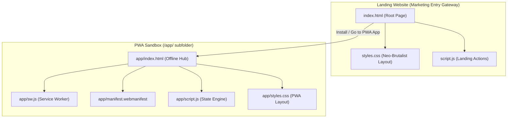

# ⚡ HUSTI — Aesthetic Offline-First Savings Habit PWA

<div align="center">
  <p align="center">
    A premium, neo-brutalist, light-themed savings habit calendar app that lives entirely on your device. Zero cloud databases. Zero accounts. Zero subscription fees.
  </p>

  <!-- GitHub stats & standard badges -->
  <a href="https://github.com/Praful-7723/husti-open/stargazers"></a>
  <a href="https://github.com/Praful-7723/husti-open/blob/main/LICENSE"></a>
  <a href="https://github.com/Praful-7723/husti-open/commits/main"></a>
  <a href="https://developer.mozilla.org/en-US/docs/Web/Progressive_web_apps"></a>

  <br/><br/>

  <!-- Custom Link Badges in World Monitor style -->
  <table>
    <tr>
      <td><strong>🌐 WEB PORTAL</strong></td>
      <td><a href="https://husti-open.vercel.app"></a></td>
    </tr>
    <tr>
      <td><strong>📱 PWA APP</strong></td>
      <td><a href="https://husti-open.vercel.app/app"></a></td>
    </tr>
    <tr>
      <td><strong>🎨 DESIGN</strong></td>
      <td></td>
    </tr>
    <tr>
      <td><strong>🔒 PRIVACY</strong></td>
      <td></td>
    </tr>
  </table>

  <br/>

  <!-- Vercel quick deploy button -->
  <a href="https://vercel.com/new/clone?repository-url=https%3A%2F%2Fgithub.com%2FPraful-7723%2Fhusti-open"></a>

  <br/><br/>

  <h4>
    <a href="#-why-husti">Why HUSTI?</a>
    ·
    <a href="#-architecture-mapping">Architecture</a>
    ·
    <a href="#-features-bento-grid">Features</a>
    ·
    <a href="#-quickstart">Quickstart</a>
    ·
    <a href="#-vercel-deployment">Deploy</a>
  </h4>
</div>

---

## 📖 Why HUSTI?

Traditional budget apps focus on complex spreadsheets, endless transaction categorization, and data-harvesting cloud accounts—often locking basic habit tracking behind monthly subscriptions. 

**HUSTI redesigns the savings experience:**
- **Zero Account Creation:** Zero email requests, zero passwords. Just open the app and track.
- **100% Sandboxed LocalStorage:** Your financial statistics never touch the internet. Stored entirely inside browser client cache.
- **Habit-Driven Calendar:** Uses visual grid streaks to motivate consistent daily savings habits rather than boring transaction logs.

---

## 📐 Architecture Mapping

HUSTI splits the marketing entry and PWA sandbox scope to guarantee privacy, loading speed, and offline reliability:



---

## 🍱 Features Bento Grid

| Feature | Details | Tech Integration |
| :--- | :--- | :--- |
| 📅 **Visual Calendar** | Color-coded grid showing streaks and skips at a glance. | CSS Grid / LocalStorage |
| 🏷️ **Quick Presets** | Log savings in under 5 seconds with customizable one-tap buttons. | Presets Configuration |
| 📈 **Local Analytics** | Consistency score indexing, 30-day savings trends, no trackers. | Offline SVG Charts |
| 🎯 **Goal Progress** | Set targets (e.g. "Emergency Fund") and watch visual trackers fill. | Dynamic Offset Progress |
| 💾 **JSON Backups** | Export local state to a JSON file to transfer between devices. | File System API |
| 🏆 **Trophy Streaks** | Gamified daily milestones to keep saving habits fun. | Local Habit Engine |

---

## ⚡ Quickstart

### Prerequisites
Make sure you have [Node.js](https://nodejs.org/) installed to run Vite & local preview build steps.

### 1. Clone the repository
```bash
git clone https://github.com/Praful-7723/husti-open.git
cd husti-open
```

### 2. Install dependencies
```bash
npm install
```

### 3. Build static distribution files
```bash
npm run build
```

### 4. Serve preview server
Launch the local HTTP preview server:
```bash
npx serve . -l 5190
```
- Open **[http://localhost:5190](http://localhost:5190)** to view the Landing Website.
- Open **[http://localhost:5190/app/](http://localhost:5190/app/)** to run the offline PWA.

---

## 🚀 Vercel Deployment

HUSTI is fully configured for zero-config Vercel hosting. 

1. Link your GitHub account to **[Vercel](https://vercel.com/)**.
2. Click **Add New Project** and select `husti-open`.
3. Vercel automatically uses [`vercel.json`](./vercel.json) to apply correct builds:
   - **Framework Preset**: Other (Static Files)
   - **Build Command**: `npm run build`
   - **Output Directory**: `dist`
4. Click **Deploy**. Your premium HUSTI site is live!

---

## 🛠️ Contributing

We welcome contributions to expand color palettes, wallpapers, and templates!
1. Fork the repo.
2. Implement your adjustments.
3. Submit a Pull Request.

Designed & Developed by **[Praful](https://porfolio-rho-blush.vercel.app/)**
